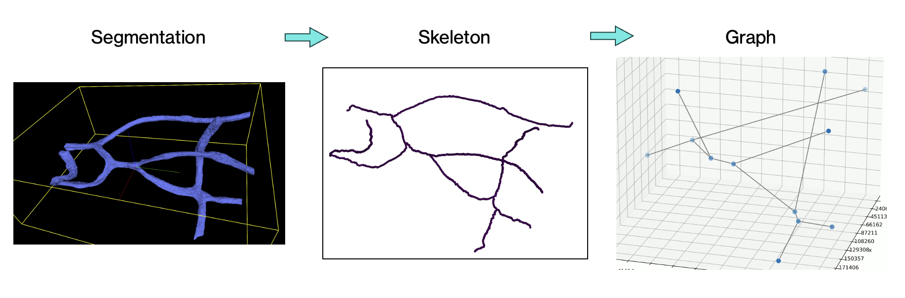
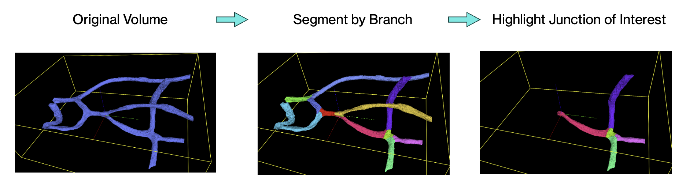
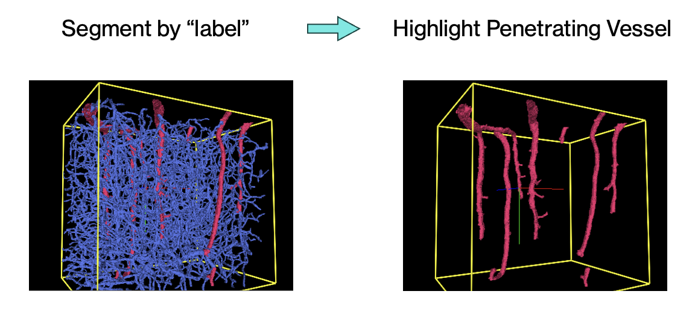
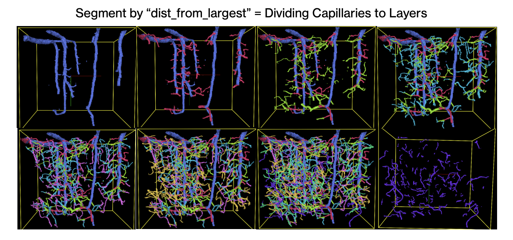

# Graph-Based Segmentation Toolbox for Blood Vessel Volumes

**Efficiently segment and analyze large vascular datasets with a customizable, high-performance toolbox.**

##  Introduction

This project introduces a **Graph-Based Segmentation Toolbox** designed to streamline the analysis of EM-level blood vessel data. The toolbox simplifies large vascular datasets, enabling researchers to efficiently segment, visualize, and analyze vascular structures with customizable metrics. Its primary goals include:
1. Ensuring smooth and accurate segmentation boundaries.
2. Minimizing computational runtime, even for large-scale datasets.
3. Allowing customizable segmentation based on node attributes.

### Key Features and Achievements
- **Smooth Segmentation Boundaries**: By skeletonizing vascular volumes into ~10k sparse nodes (instead of ~10m densely packed voxels), the toolbox ensures smooth boundaries between segments by relabeling voxels based on weighted attributes such as radii.
- **Runtime Optimization**: Leveraging a single-pass distance transform algorithm, the toolbox processes large datasets like MICrONS in under 15 minutes—down from 24 hours+ using previous methods.
- **Custom Metrics for Tailored Segmentation**: Researchers can segment volumes using attributes like branch size, radius, proximity to major vessels, or new attributes calculated from existing ones tailoring results to specific study needs.
- **Post-Skeleton Processing**: Generating perfect skeletons is nearly impossible for large-scale data. The toolbox assumes imperfections in the skeleton and addresses them through post-processing steps. These include:
  - Merging broken or disconnected graph components.
  - Relabeling branch points to prioritize larger branches.
  - Correcting small branches near major vessels.
  - Removing floating artifacts using connected component analysis.

This toolbox has been validated on large datasets such as the MICrONS Cubic Millimeter dataset, successfully highlighting penetrating vessels. Beyond vascular segmentation, the core concept of skeletonizing volumetric data and segmenting by node attributes has the potential to be applied to other branch-like structures, such as dendrites and axons. This could pave the way for uncovering new structural and functional insights in connectomics.

## Usage Instructions

### **Installation**
1. Clone this repository:
   ```bash
   git clone https://github.com/ShyuuTheLast/Vessel2Graph.git
   ```
2. Install dependencies:
   ```bash
   pip install -r requirements.txt
   ```
### **Input Requirements**
- The toolbox accepts **HDF5 volumes** as input.
- Each volume should be isotropically scaled, and skeletonization must be performed prior to segmentation.
- Example of pre-processed input:
  - A skeletonized volume generated by [Kimimaro](https://github.com/seung-lab/kimimaro).

### **Running the Toolbox**
1. Open the `main.py` script in your editor of choice.
2. Modify the parameters in the `__main__` block to suit your dataset and goals:
   ```python
   # Input parameters
   input_file = "sample.h5"  # Path to the input HDF5 file
   dataset_name = "main"     # Dataset name within the HDF5 file

   # Output parameters
   output_file = "segmented_output.h5"  # Name of the output segmented volume
   stats_output_path = "stats_output.npz"  # File path for saving statistics

   # Skeleton-related parameters
   generate_new_skeleton = True  # Set to False if an existing skeleton is provided
   teasar_params = '{"scale": 4, "const": 500}'  # Skeletonization parameters
   existing_skeletons_path = "existing_skeletons.npz"  # Path to existing skeleton file
   save_skeleton = True  # Whether to save the generated skeleton
   skeleton_output_path = "output_skeleton.npz"  # File path for saving the skeleton

   # Paths and neighbor-related parameters
   save_paths_list = True  # Whether to save paths as a list of nodes
   paths_list_name = "branches.pkl"  # Name of the file to save paths as pickle
   voxel_size = (320, 256, 256)  # Scaling factors for the volume's z, y, x axes
   target_labels = [1]  # Labels to keep in the input volume
   ...
   ```
3. Save your changes and run the script:
   ```bash
   python main.py
   ```
### **Output Description**
The following files are generated:
1. **Segmented Volume** (`segmented_output.h5`):
   - An HDF5 file containing the segmented vessel volume.
2. **Statistics File** (`stats.npz`):
   - Contains node-level attributes, branch-level details, and additional metrics (e.g., branch lengths, radii, tortuosity).
3. **Visualizations** (optional):
   - Generate Neuroglancer-compatible visualizations or custom videos of the segmented graph.

## Results

#### **1. Segment by Branch**

Each branch is segmented topologically. Unrelated parts that happen to be geometrically nearby are no longer included during highlighting.

#### **2. Segment by Branch Size**

Branches are categorized by size, distinguishing large vessels like arteries from smaller capillaries. In the MICrONS Millimeter dataset, this method can highlight the penetrating vessels.

#### **3. Segment by Distance from Largest**

Capillaries branches are segmented by their proximity to the largest group of vessels, allowing layer-by-layer visualizations.

## Future Directions

The toolbox is functional and efficient but leaves room for further development. Here are some potential improvements:

- **More Sophisticated Branch Representation**  
  Currently, each branch is represented by a single value (median radius). Enhancing this to include more descriptive statistics or features could improve the segmentation and analysis.

- **Improved Clustering Methods**  
  The current clustering is based on median radii, resulting in binary segmentation into "big" and "small" categories. Developing more nuanced clustering methods or incorporating machine learning could yield finer distinctions.

- **Artery/Vein Classification**  
  Adding functionality to differentiate arteries from veins could help in more specialized vascular studies.

- **Graph Neural Networks for Pattern Recognition**  
  Applying graph neural networks to identify topologically similar structures could reveal deformation or other patterns of interest.

- **Generalization Beyond Blood Vessels**  
  Adapting the toolbox for other branch-like structures, such as dendrites and axons, could open new applications in neuroscience and beyond.

- **Integrated Skeleton Refinement**  
  Improving skeletonization to reduce artifacts directly or integrating pre-processing steps for better input data quality could enhance results.
